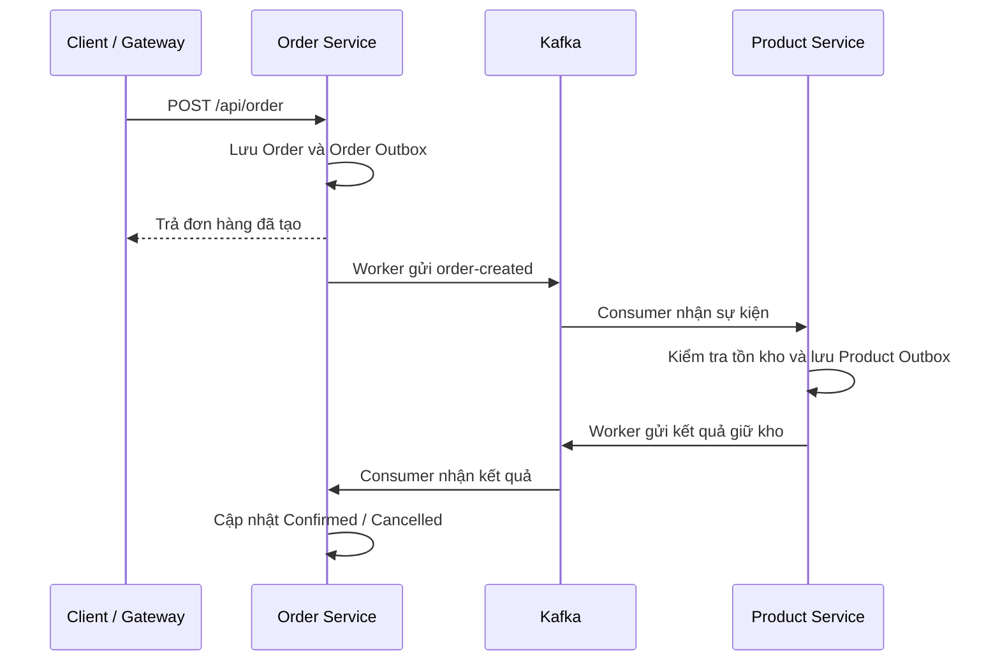

# DemoSagaSolution

Demo hệ thống đặt hàng theo kiến trúc **microservices**, sử dụng **Saga choreography** và **Transactional Outbox**. Các dịch vụ trao đổi sự kiện qua Kafka để xử lý tồn kho và cập nhật trạng thái đơn hàng bất đồng bộ.

## Công nghệ

- **ASP.NET Core / .NET 8:** xây dựng API.
- **EF Core 9 + SQL Server:** lưu đơn hàng, sản phẩm và Outbox.
- **Apache Kafka:** trao đổi sự kiện giữa các dịch vụ.
- **Ocelot:** API Gateway.
- **BackgroundService:** đọc Outbox và gửi sự kiện qua Kafka producer.
- **Aspire AppHost, Docker Compose, Swagger:** hỗ trợ chạy và quan sát demo.

## Cấu trúc project

| Project / thư mục | Vai trò |
|---|---|
| `DemoSaga.ApiGateway` | Chuyển tiếp API đến Order Service và Product Service |
| `DemoSaga.OrderApi` | Tạo đơn, lưu Order Outbox và nhận kết quả xử lý tồn kho |
| `DemoSaga.ProductApi` | Quản lý sản phẩm, trừ tồn kho và lưu Product Outbox |
| `DemoSaga.Shared` | Kafka producer và consumer dùng chung |
| `DemoSaga.Models` | DTO sự kiện đơn hàng |
| `DemoSaga.AppHost` | Khởi chạy các project .NET qua Aspire |
| `docker-compose.yml` | Khởi chạy Kafka, Kafka UI và SQL Server |

Hai dịch vụ hiện dùng chung database `DemoSaga`, với các bảng `Orders`, `Products`, `OrderOutBoxMessages` và `ProductOutBoxMessages`.

## Luồng xử lý



| Sự kiện | Ý nghĩa |
|---|---|
| `order-created` | Có đơn hàng mới cần xử lý tồn kho |
| `product-reserved` | Sản phẩm tồn tại và đủ tồn kho; đơn được xác nhận |
| `product-reserved-failed` | Sản phẩm không tồn tại hoặc không đủ tồn kho; đơn bị hủy |

**Outbox:** thay vì gửi Kafka ngay trong code nghiệp vụ, dịch vụ lưu sự kiện cùng thay đổi dữ liệu trong một lần `SaveChangesAsync()`. Worker đọc sự kiện chưa gửi, gọi producer rồi cập nhật `PublishedAtUtc` khi gửi thành công.

Order worker lấy tối đa **10 message/lượt**, chờ **5 giây** giữa các lượt; Product worker lấy tối đa **10 message/lượt**, chờ **10 giây**. Vì xử lý bất đồng bộ, phản hồi tạo đơn có thể chưa có trạng thái cuối cùng.

## Chạy nhanh

Chuẩn bị .NET SDK/runtime phù hợp với các project và Docker Compose. Chạy các lệnh tại thư mục solution; kiểm tra connection string của hai service khớp SQL Server trong Compose.

**1. Khởi động hạ tầng:**

```bash
docker compose up -d
```

Chờ Kafka và SQL Server sẵn sàng. Tạo ba topic ở trên qua Kafka UI nếu chưa có.

**2. Áp dụng migrations** (cần `dotnet-ef` 9.0.9):

```bash
dotnet ef database update --project DemoSaga.OrderApi --startup-project DemoSaga.OrderApi --context OrderDbContext
dotnet ef database update --project DemoSaga.ProductApi --startup-project DemoSaga.ProductApi --context ProductDbContext
```

**3. Chạy mỗi lệnh trong một terminal riêng:**

```bash
dotnet run --project DemoSaga.ProductApi --launch-profile http
dotnet run --project DemoSaga.OrderApi --launch-profile http
dotnet run --project DemoSaga.ApiGateway --launch-profile http
```

Có thể dùng `DemoSaga.AppHost` để chạy các project .NET qua Aspire. AppHost hiện không tự tạo hạ tầng hoặc áp dụng migrations; nếu Aspire cấp cổng khác, cần cập nhật downstream trong `ocelot.json`.

## API và kiểm tra demo

Gateway: **http://localhost:5156**.

| Method | Endpoint | Chức năng |
|---|---|---|
| GET | `/api/product` | Danh sách sản phẩm |
| GET | `/api/product/{id}` | Chi tiết sản phẩm |
| POST | `/api/order` | Tạo đơn hàng |
| GET | `/api/order` | Danh sách đơn và trạng thái |

Lấy ID sản phẩm từ API rồi gửi body tạo đơn:

```json
{
  "productId": "4bc897b3-cc6f-471a-9610-5174a792cbe2",
  "quantity": 1,
  "price": 1000
}
```

Sau khi worker và consumer xử lý, kiểm tra đơn qua **http://localhost:5018/api/order** và tồn kho qua **http://localhost:5239/api/product**. Gọi trực tiếp service giúp tránh dữ liệu cũ từ cache Gateway.

Swagger: http://localhost:5018/swagger và http://localhost:5239/swagger. Kafka UI: http://localhost:8081.
